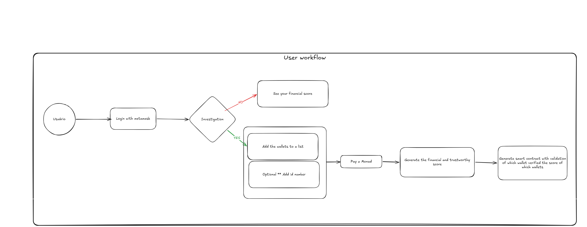
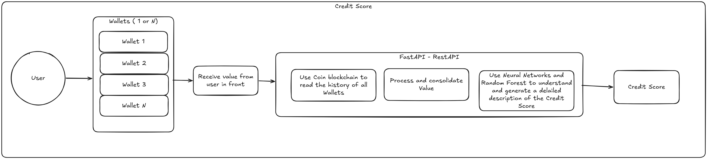
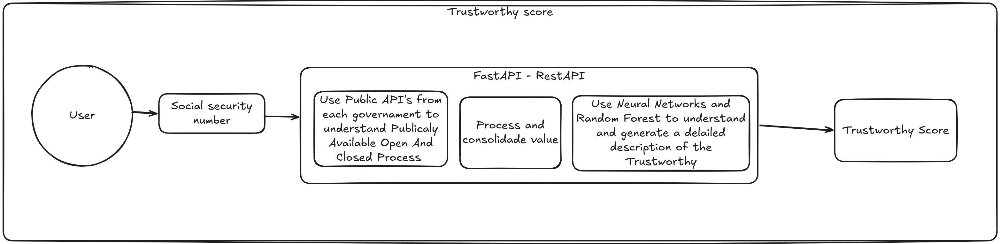

# TrustLayer — Transparent Financial Credit Intelligence

> Decentralized, AI-powered credit scoring. Explainable, verifiable, owned by you.

TrustLayer is a decentralized financial identity platform built on Monad. Users generate and verify their creditworthiness on-chain through AI-driven analysis of multi-wallet transaction history, receiving a portable credit passport (NFT) and reward tokens (MONAD) that any merchant or lender can instantly verify.


---

## Table of Contents

- [The Problem](#contracts-deployed-in-Monad)
- [The Problem](#-the-problem)
- [The Solution](#-the-solution)
- [Features](#-features)
- [Architecture](#-architecture)
- [Tech Stack](#-tech-stack)
- [Smart Contracts](#-smart-contracts)
- [Installation](#-installation)
- [Quick Start](#-quick-start)
- [Deployment](#-deployment)
- [Project Structure](#-project-structure)
- [Why Monad](#-why-monad)
- [Business Model](#-business-model)
- [Roadmap](#-roadmap)
- [License](#-license)

---

## contracts deployed in Monad

Url validated at: [Monad Testnet Explorer](https://monad-testnet.socialscan.io/address/0x68c76706a5ad6d86484a97b05d7f2f369c15b23a)

App Wallet address: `0x68c76706a5ad6d86484a97b05d7f2f369c15b23a`

Example Block: `https://monad-testnet.socialscan.io/block/36584296` - `https://monad-testnet.socialscan.io/block/36584304`

Example contract address: `0xb1bb3e0dd7642a69d60bcc30c4cc27ce0787b97a`

---

## The Problem

Traditional credit scoring is a **black box**:

- **No transparency** — users cannot understand why their score is what it is
- **No agency** — without knowing the factors, there is no way to improve
- **Fragmented history** — credit data is siloed across institutions, non-portable
- **Gatekept access** — only large institutions can assess creditworthiness
- **No rewards** — good payment behavior goes unrecognized

This affects most: unbanked individuals, informal-economy workers, entrepreneurs, and anyone in markets with limited traditional banking infrastructure.

---

## The Solution

TrustLayer turns credit scoring from a black box into a **transparent, portable, user-owned asset**:

1. **Multi-Wallet Analysis** — AI models analyze transaction history across all linked wallets for a holistic financial picture
2. **Dual Score System** — a *Credit Score* (on-chain behavior) and a *Trustworthy Score* (optional KYC/background check) give a complete view
3. **Explainable AI** — every score comes with a factor breakdown so users know exactly what drives their result
4. **NFT Credit Passport** — the score is minted on-chain as an ERC-721, portable and verifiable by any merchant or DeFi protocol
5. **Reward System** — punctual payments earn MONAD (ERC-20) tokens, gamifying good financial behavior
6. **Pay-per-Use on Monad** — each assessment costs a small MON fee, recorded immutably via `RiskScoreOracle`



---

## Features

### Credit & Trust Scoring



- **Credit Score** (0–1000): derived from on-chain wallet data — tx volume, balance patterns, counterparty diversity, activity streak
- **Trustworthy Score** (0–1000): optional layer adding KYC/AML signal and background check data



- **Factor breakdown** per score — users see exactly which behaviors increase or decrease their score
- **AI Prediction Engine** — forecasts score trajectory and surfaces preventive recommendations
- **Score Improvement Recommendations** — personalized, actionable guidance

### Investigation Flow (New)

- **Multi-Wallet Form** (`WalletListForm`) — submit 1–N wallet addresses for aggregate analysis
- **Optional ID / KYC input** — link national ID for enhanced trustworthy score
- **Pay & Generate** (`ScorePaymentModal`) — pay a small MON fee via `RiskScoreOracle.submitScore()`, then trigger the ML backend; progress stepper shows each stage
- **On-chain Validation** — `ValidationRecord` contract stores an immutable record of which wallets were assessed, by which oracle, and at what score

### Dashboard & Gamification

- **6-tab dashboard**: Overview · Score Detail · Rewards · Achievements · Leaderboard · Profile
- **NFT Credit Passport** display with level badge (Bronze → Silver → Gold → Platinum → Diamond)
- **Rewards calculator** and tier table (MONAD earned per level / streak)
- **Activity feed**, **progress chart**, **score trend chart**, **comparison card**
- **Goals tracker** with AI-generated milestones
- **Notifications panel** for score changes and achievement unlocks
- **Share panel** — share achievements to X, Facebook, Instagram

### For Merchants & DeFi Protocols

- Instant on-chain score verification — no centralized database needed
- Cryptographic proof of authenticity via `ValidationRecord`
- Standard ERC-721 NFT passport compatible with any wallet or marketplace

---

## Architecture

```
┌───────────────────────────────────────────────────────────┐
│                   Frontend (Next.js 14)                    │
│  Dashboard · WalletListForm · ScorePaymentModal            │
│  TrustScoreCard · NFTCard · AIChat · RewardsTable …       │
└────────────────────────┬──────────────────────────────────┘
                         │  wagmi v2 / viem (Web3)
                         │  axios (Backend API)
          ┌──────────────┴──────────────┐
          ▼                             ▼
┌─────────────────┐          ┌──────────────────────────────┐
│  Monad Blockchain│          │  Backend (FastAPI / Python)  │
│                 │          │  ┌──────────────────────────┐ │
│  CreditNFT      │◄─────────┤  │ /scores/credit           │ │
│  RewardSystem   │          │  │ /scores/trustworthy      │ │
│  MockCCOP       │          │  │ blockchain_controller    │ │
│  RiskScoreOracle│◄─────────┤  │ score_controller (ML)    │ │
│  WalletRegistry │          │  └──────────────────────────┘ │
│  ValidationRecord│         └──────────────────────────────┘
└─────────────────┘
```

### Request Flow

1. User connects MetaMask and lands in demo mode
2. User clicks **Solicitar Análisis** → `WalletListForm` opens
3. User adds wallet addresses (and optionally a national ID)
4. `ScorePaymentModal` shows the MON fee; user pays on-chain via `RiskScoreOracle`
5. Frontend calls `POST /scores/credit` (and `/scores/trustworthy` if ID provided)
6. Backend fetches on-chain data via Monad JSON-RPC, runs ML model, returns score + breakdown
7. Backend oracle signs and writes result to `ValidationRecord`
8. Dashboard updates with new `TrustScoreCard` and factor breakdown

---

## Tech Stack

### Frontend
| Layer | Technology |
|-------|-----------|
| Framework | Next.js 14 (App Router) |
| UI | React 18 · TypeScript · Tailwind CSS |
| Web3 | wagmi v2 · viem |
| Wallet | MetaMask connector |
| Charts | Recharts |
| Icons | Lucide React |

### Backend
| Layer | Technology |
|-------|-----------|
| Framework | FastAPI (Python 3.12) |
| ML | scikit-learn (RandomForestRegressor) · pandas · numpy |
| Blockchain | JSON-RPC via `requests` (no web3 dependency) |
| Database | SQLAlchemy + PostgreSQL |
| Packaging | uv / pyproject.toml |

### Smart Contracts
| Layer | Technology |
|-------|-----------|
| Language | Solidity 0.8.20 |
| Framework | Hardhat |
| Standards | OpenZeppelin 5 (ERC-721 · ERC-20) |
| Network | Monad Testnet (chainId `10143`) · Mainnet (`143`) · Local (`31337`) |

---

## Smart Contracts

### CreditNFT (ERC-721)
The user's portable credit passport.
- `mintCreditNFT()` — creates the NFT for a new user
- `recordPayment()` — updates Payment Score and consecutive streak
- `linkMonadWallet()` — associates a Monad wallet to the NFT
- `getCreditData()` — returns full credit data for a token

### RewardSystem
Distributes MONAD rewards based on level and payment streak.
- `calculateReward()` — computes reward for a given level/streak
- `distributeReward()` — transfers MONAD to user
- `getUserRewards()` — returns full reward history

### MockCCOP (ERC-20)
The MONAD reward token, compatible with any standard wallet.

### RiskScoreOracle *(new)*
Stores AI-generated scores on-chain and gates score generation behind a MON fee.
- `submitScore()` — payable; accepts ML score from authorized backend oracle
- `scoreFee()` — returns current fee in MON

### WalletRegistry *(new)*
Maps a user to their set of linked wallets for multi-wallet analysis.
- `addWallet()` — registers an additional wallet under the caller's identity
- `getWallets()` — returns all wallets for a user

### ValidationRecord *(new)*
Immutable audit trail: which oracle validated which user's score.
- `record()` — called by authorized oracle after scoring
- `records(address)` — returns full history for a subject
- Emits `ScoreValidated(subject, score, oracle, timestamp)`

---

## Installation

### Prerequisites
- Node.js 18+
- Python 3.12+ with `uv`
- MetaMask browser extension
- Git

### 1. Clone

```bash
git clone https://github.com/USERNAME/monad-blitz-medellin.git
cd monad-blitz-medellin
```

### 2. Contracts

```bash
cd contracts
npm install
```

### 3. Frontend

```bash
cd frontend
npm install
cp env.example.txt .env.local
# Fill in contract addresses in .env.local
```

### 4. Backend

```bash
cd backend
uv sync
cp env.example .env
# Set MONAD_RPC_URL, ORACLE_PRIVATE_KEY, DB connection
```

---

## Quick Start

### Local Development (3 terminals)

**Terminal 1 — Hardhat node:**
```bash
cd contracts && npx hardhat node
```

**Terminal 2 — Deploy contracts:**
```bash
cd contracts && npm run deploy:local
```

**Terminal 3 — Frontend:**
```bash
cd frontend && npm run dev
```

**Terminal 4 (optional) — Backend:**
```bash
cd backend && uv run uvicorn main:app --reload
```

Open `http://localhost:3000`, connect MetaMask to Hardhat Local (Chain ID 31337).

The app runs in **demo mode** automatically until real contract addresses are provided in `frontend/.env.local`.

### Windows (all-in-one)

```powershell
.\scripts\start-all.ps1
```

### Backend API

```bash
# Credit score from wallet list
curl -X POST http://localhost:8000/scores/credit \
  -H "Content-Type: application/json" \
  -d '{"wallets": ["0xabc..."]}'

# Trustworthy score (optional KYC)
curl -X POST http://localhost:8000/scores/trustworthy \
  -H "Content-Type: application/json" \
  -d '{"national_id": "12345678", "country_code": "CO"}'
```

### Tests

```bash
# Frontend E2E (Playwright)
cd frontend && npm run test:e2e

# Smart contracts
cd contracts && npm test
```

---

## Deployment

### Frontend — Vercel (recommended)

```bash
npm install -g vercel
cd frontend && vercel
```

### Contracts — Monad Testnet (Chain ID 10143)

```bash
# Set PRIVATE_KEY and MONAD_TESTNET_RPC in contracts/.env
cd contracts
npm run deploy:monad-testnet
npm run verify:monad-testnet
```

### Contracts — Monad Mainnet (Chain ID 143)

```bash
npm run deploy:monad
npm run verify:monad
```

### Backend — Docker

```bash
docker compose up backend
```

Required env vars (see `backend/env.example`):

| Variable | Description |
|----------|-------------|
| `MONAD_RPC_URL` | Monad JSON-RPC endpoint |
| `ORACLE_PRIVATE_KEY` | Backend signing key for `RiskScoreOracle` |
| `RISK_ORACLE_ADDRESS` | Deployed `RiskScoreOracle` address |
| `WALLET_REGISTRY_ADDRESS` | Deployed `WalletRegistry` address |
| `VALIDATION_RECORD_ADDRESS` | Deployed `ValidationRecord` address |

---

## Project Structure

```
monad-blitz-medellin/
├── contracts/                  # Hardhat project
│   ├── contracts/
│   │   ├── CreditNFT.sol
│   │   ├── RewardSystem.sol
│   │   ├── MockCCOP.sol
│   │   ├── RiskScoreOracle.sol
│   │   ├── WalletRegistry.sol
│   │   └── ValidationRecord.sol
│   ├── scripts/
│   └── test/
│
├── frontend/                   # Next.js 14
│   └── src/
│       ├── app/page.tsx        # Main dashboard (wagmi config + 6 tabs)
│       ├── components/         # 27 React components
│       │   ├── WalletListForm.tsx      # Multi-wallet input
│       │   ├── ScorePaymentModal.tsx   # Pay MON → generate score
│       │   ├── TrustScoreCard.tsx      # Dual score display
│       │   ├── NFTCard.tsx
│       │   ├── AIChat.tsx
│       │   └── ...
│       ├── hooks/
│       │   └── useTrustLayer.ts
│       └── lib/
│           ├── contracts.ts    # Addresses by chainId
│           └── abis.ts
│
├── backend/                    # FastAPI + ML
│   ├── main.py
│   ├── routers/scores.py
│   ├── controller/
│   │   ├── blockchain_controller.py
│   │   └── score_controller.py
│   ├── models/
│   └── schemas/
│
├── docs/
│   ├── img/
│   │   ├── credit_score.png
│   │   ├── trust_score.png
│   │   └── user_workflow.png
│   └── action_plan.md
│
└── scripts/
    ├── start-all.ps1
    └── start-all.sh
```

---

## Why Monad

| Need | Monad Advantage |
|------|----------------|
| Frequent credit assessments | 6,000+ TPS, no congestion |
| Affordable pay-per-use | Low gas fees make micropayments viable |
| Complex scoring logic | Full EVM compatibility, Solidity contracts run as-is |
| Easy user onboarding | MetaMask and emerging wallets natively supported |
| Developer velocity | Rich tooling, active ecosystem, EVM-familiar patterns |

---

## Business Model

| Stream | Description |
|--------|-------------|
| Per-assessment fee | Users pay MON tokens each time a credit score is generated |
| Premium subscriptions | Unlimited monthly assessments + priority processing |
| B2B licensing | Lending and DeFi platforms integrate TrustLayer scoring via API |
| Background check partnerships | Revenue share with KYC/AML providers |

---

## Roadmap

### Phase 1 — MVP (Current)
- [x] Smart contracts: CreditNFT, RewardSystem, MONAD
- [x] Smart contracts: RiskScoreOracle, WalletRegistry, ValidationRecord
- [x] Frontend dashboard (6 tabs, demo mode)
- [x] Multi-wallet form + Score payment modal
- [x] Dual score display (Credit + Trustworthy)
- [x] Backend ML scoring (Credit + Trustworthy endpoints)
- [x] E2E tests (Playwright)

### Phase 2 — Early Adoption (Q3–Q4 2026)
- [ ] Deploy to Monad Mainnet, disable demo mode
- [ ] Connect live on-chain data to dashboard
- [ ] RainbowKit multi-wallet connector
- [ ] CI/CD pipeline (GitHub Actions: build + lint + tests)
- [ ] SMB lending platform partnerships

### Phase 3 — Mainstream Integration (2027)
- [ ] Public API for third-party integrations
- [ ] Mobile app (React Native)
- [ ] Traditional finance data bridge
- [ ] Employment and insurance verification use cases

### Phase 4 — Global Scale (2027+)
- [ ] International market expansion
- [ ] Regulatory compliance (FCRA, GDPR)
- [ ] DAO governance
- [ ] Institutional adoption

---

## License

MIT — see [LICENSE](LICENSE) for details.

---

## Acknowledgements

- **OpenZeppelin** — secure, standard smart contract libraries
- **Monad** — high-performance EVM-compatible L1
- **Next.js** — React framework with App Router
- **wagmi / viem** — Ethereum hooks and client
- **scikit-learn** — ML scoring models

---

<div align="center">

**Built for financial inclusion — powered by Monad**

</div>
